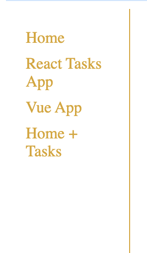
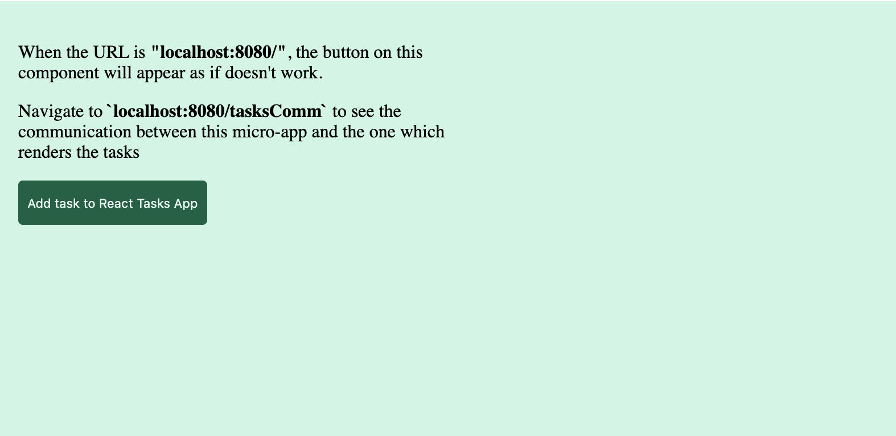
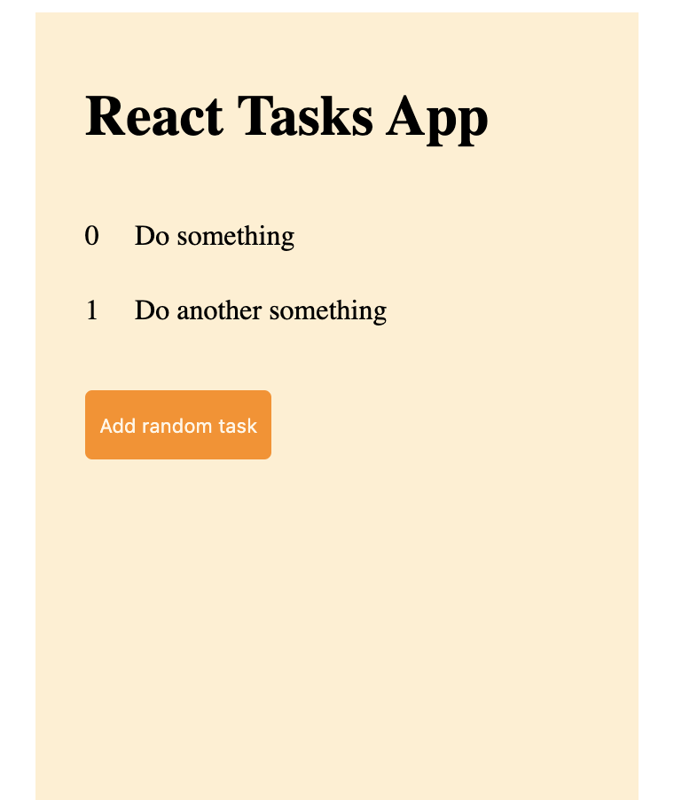
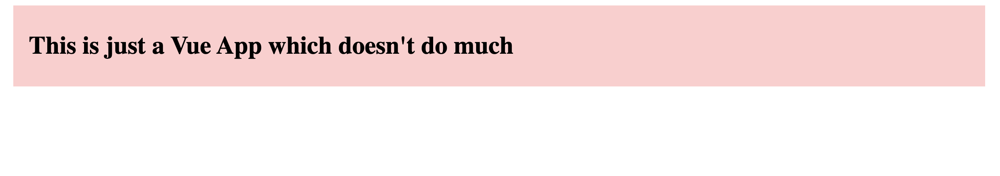
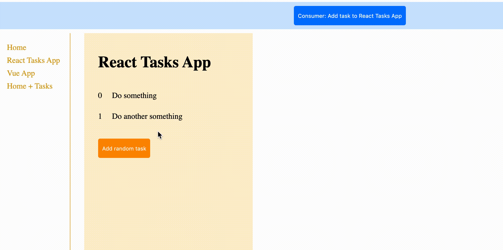
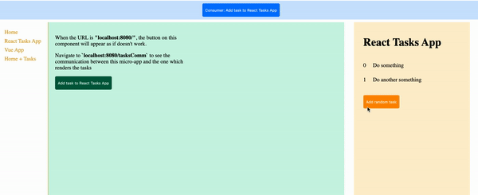

# Micro-Frontend POC with Single-SPA

This is a simple project which is built to test out the concept of having multiple Micro-Frontend apps co-existing. This demo/POC has been built with the [single-spa](https://single-spa.js.org/) framework (which makes it easier to have multiple micro-apps - built with different JS frameworks - work together well).

# Project Architecture

The project consists of several micro-apps, and also a consumer app (which renders everything). There are multiple routes on which different micro-apps become active. Some micro-apps have their internal local state. There is also a message passing mechanism implemented to enable communication between:

- The consumer app and micro-apps
- Different micro-apps

Each micro-app needs to first be registered with single-spa in the config file. For this, we need the name of the app, a loading function and an activity function.

After registering applications, we need to implement a starter point for each application. This file usually calls the framework specific wrapper for our application (such as `singleSpaReact` for React) and passes in some information such as the reference to the DOM element where the app needs to be rendered in, and the root component of the application. Furthermore, it also exports 3 functions which all apps need to implement: 

- Bootstrap
- Mount
- Unmount

These 3 functions can have any implementation within them according to the scenario we require. However, single-spa expects these functions to return a Promise so that it knows when the function has finished and it can perform further executions. ([Read more here](https://medium.com/canopy-tax/a-step-by-step-guide-to-single-spa-abbbcb1bedc6))

Code for registration of application can be be found in the [single-spa.config.js](single-spa.config.js) file. Whereas, starter files for each app can be found in their directories. For example, for the React Tasks App, it can be found in the [main.app.js](src/react/main.app.js) file.

## The Consumer App

The consumer app is the main project itself. This is denoted by the `index.html` file. 

### Structure of `index.html` file

This file defines two parts. The first part is a global button (with blue background) which is visible globally as part of the app. The second part is containers for different micro-apps to be rendered inside. This can be be better defined as one part is some global functionality of the consumer that is always required and the 2nd part is the template for micro-apps to be rendered depending on different routes.

The consumer app is denoted by blue color:


The consumer app can communicate with the `React Tasks App` but this only works when the `React Tasks App` is active.

## App Routes

The app has the following routes:

- / (root)
- /react
- /vue
- /tasksComm

Each route renders a different micro-app. The `/tasksComm` route renders 2 micro-apps together.

The app-level routing is handled by `single-spa`. However, we need to supply a method to tell single-spa when each app needs to be rendered. We can choose to use simple `location` API of the browser for this (like it is used in this project), or use a more complex solution for this if required.

Routing logic can be viewed in the [Single-Spa config file](single-spa.config.js).

## The Micro-Apps

This project is composed of 4 micro-apps

- Navbar App (left side navigation)
- Home App
- Tasks App
- Vue App

All 3 apps other than Vue App are built with React

### Navbar

- Technology used: React
- Which route is it active on: `*`
- Which container does it use: div with id `navbar`



### Home

- Technology used: React
- Which route is it active on: `/`, `tasksComm`
- Which container does it use: div with id `home`

The home app is denoted by green color:



This application does not have its own state, but has a way to communicate with the Tasks App. But this is only possible when the Tasks app is also active. More on this in the [App Communication section](#app-communication)

### Tasks

- Technology used: React
- Which route is it active on: `/react`, `/tasksComm`
- Which container does it use: div with id `reacttasks`

The tasks app is denoted by orange color:



This application has a local state as well. This is implemented using `Redux`

### Vue

- Technology used: Vue
- Which route is it active on: `/vue`
- Which container does it use: div with id `vue`

The consumer app is denoted by pink color:



## App Communication

A main consideration for this project was to experiment with a way for communication between the apps. There were multiple patterns available for this, however the pattern implemented allows 2-way communication. This means that any application can talk to any other application. This is possible with the use of `window.postMessage` for apps to send messages. Here's a brief breakdown of the pattern:

### Message Interface

A common message interface is used so that all apps know how they should construct a message. The interface isn't implemented in code in this project (since it is a JS project but was kept in mind when writing the code). 

```js
interface Message {
    dispatchedFor: string;
    dispatchedBy: string;
    messageType: string;
    payload: any;
}
```

| Field         | Description                                                   |
| ------------- | ------------------------------------------------------------- |
| dispatchedFor | The name of the app for which this message was dispatched     |
| dispatchedBy  | The name of the app which dispatched this message             |
| messageType   | The name of the action which should be dispatched by the app  |
| payload       | Payload for the action to be dispatched                       |

### Sending Messages

Messages can easily be sent once the interface is followed to construct a message using `window.postMessage()`

```js
const sampleMsg = {
    dispatchedBy: 'ConsumingApp',
    dispatchedFor: 'SomeApp',
    messageType: 'SOME_ACTION',
    payload: {
        someKey: 'someValue'
    }
}

window.postMessage(msg, '*');
```

### Receiving & Processing Messages

An observer pattern is followed when it comes to receiving messages. All the micro-apps and the consuming app can become observers of the `window` object to subscribe to these messages. However, each app needs to implement a message receiving and processing script. This script makes sure that the app only processes those message which are meant for that app only. This is the very reason why we use `dispatchedFor` property.

***
**NOTE**

It must be noted however that a micro-app can only receive a message when it is active (i.e bootstrapped, and mounted -  such that its root component is rendered)

***

#### Subscribing to messages/Becoming an observer

```js
window.addEventListener('message', messageHandler);
```

This `messageHandler` method will come from the script which receives messages and decides whether to pass along for processing or not.

In single-spa, this will happen within the `bootstrap` or `mount` lifecycle method that is implemented by the micro-app.

#### Processing messages

This is the simplest implementation of the `messageHandler`:

```js
function messageHandler(message) {
    if (!message) return;
    if (message.dispatchedFor !== 'AppName') return;

    processMessage(message);
}
```

If this message is not dispatched for this specific application, it will just ignore it. Otherwise, it will send it for processing. Each app can have its own way for processing the message. But one way is to dispatch an action in the local store (which the incoming message instructs the app to do so). An example of this is given below:

```js
function processMessage(message) {
    switch(message.messageType) {
        case AppActions.SomeTask: {
            return store.dispatch(
                {
                    type: AppActions.SomeTask,
                    payload: message.payload
                }
            )
        }
        case AppActions.SomeOtherTask: {
            return store.dispatch(
                {
                    type: AppActions.SomeOtherTask
                }
            )
        }
    }
}
```

### Communcation scenarios implemented

In this project, 2 communication scenarios are implemented, which are discussed below.

#### Between consumer & micro-app

The scenario implemented allows the consumer app to pass a message to the Tasks app to add a new task to the list of tasks it has already. The consumer app also passes in a payload which should be added. It is to be noted that the Tasks app needs to be active for this to work (pressing the button on the consumer app will not work unless the Tasks app is rendered).

Here's a visual demo of this:



Message sending snippet can be seen in the [index.html](index.html#L24-L34) file.

Tasks app subscribes to messages in the [main.app.js](src/react/main.app.js#L19) file in the bootstrap method. Message handling and processing functionality can be seen in [event-handler.js](src/react/event-handler.js) file.

#### Between different micro-apps

This scenario allows the home micro-app to pass a message to the Tasks app to add a new task to the list of tasks it has already. It is to be noted that the Tasks app needs to be active for this to work. This scenario shows two micro-apps rendered next to each other and being able to communicate with each other when messages are passed since both are active apps. 2-way communication can also be established such that, tasks app also sends a message to the home micro-app but for sake of simplicity, this was not demonstrated.

Here's a visual demo of this:



Message sending snippet can be seen in the [home-container component](src/home/home-container.component.js#L34-L45) file.

Tasks app subscribes to messages in the [main.app.js](src/react/main.app.js#L19) file in the bootstrap method. Message handling and processing functionality can be seen in [event-handler.js](src/react/event-handler.js) file.
